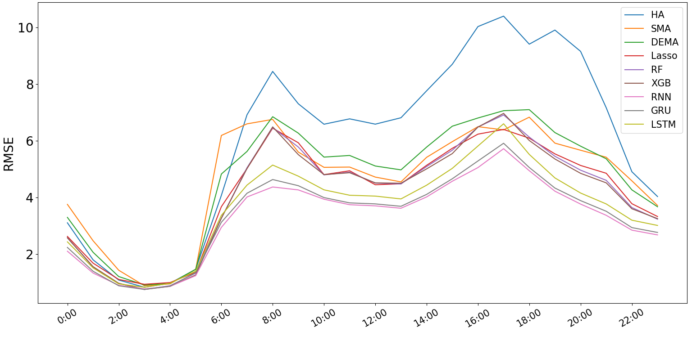
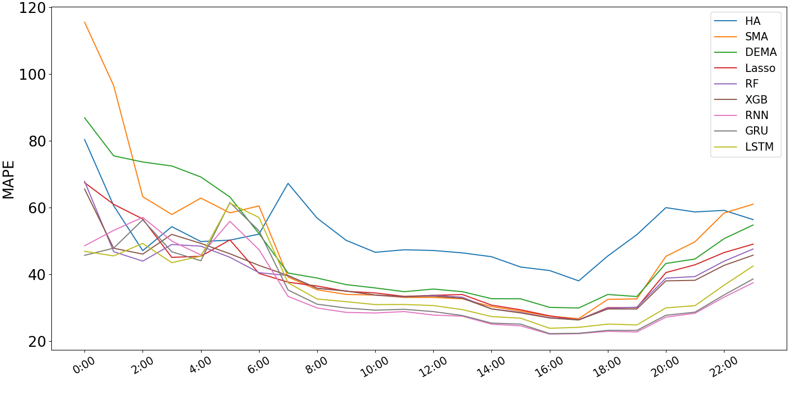

# Taxi-Demand-Prediction
This is the implementaton for my masters thesis project called " A demand prediction model for online taxi services using real-time and historical data".
## Softwares and Technology
- Python 3.5 or above
- Keras 
- Tensorflow
- scikit-learn
## Description
In this study, different predictive machine learning methods have been implemented on a real world online car-hailing company’s data to forecast the demand intensity in different zones of Tehran (Capital of Iran). Tese methods consist of prevalent time series forecasting, Tree-based regressions methods and specifcally deep-learning methods that are suitable for time series forecasting, such as long-short term memory(LSTM) neural networks and Gated recurrent units (GRU). At the end, the best RNN method is selected and its hyper parameters were optimized by genetic algorithm.
## Algorithms Implemented
- Recurrent Neural Networks (RNN)
- Gated Recurrent Units (GRU)
- Long-Short term Memory Recurrent Networks (LSTM)
- XGBoost Regressor (XGB)
- Random Forests Regressor (RF)
- LASSO Regression (Lasso)
- Double Exponential Moving Average(DEMA) 
- Simple Moving Average (SMA)
- Historical Average (HA)
## Results
Mean Absolute Percentage Error (MAPE) and Root Mean Square Error (RMSE) are used in order to compare the model performances.

